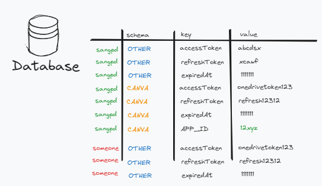

## Test 4


****

## Prerequisite:

Ensure you have the following installed on your machine:

- [Docker](https://docs.docker.com/get-docker/)
- [Docker Compose](https://docs.docker.com/compose/install/)
- Node.js v20 and Java 17 + Maven 3 (if want to build source)

****

## Project Structure

- `canva-api/` - Contains the simple api application built with Java and Spring.
- `canva-app-fe/` - Contains the [Canva App](https://www.canva.dev/docs/apps/) ui built with Webpack.
****

## Running the Application

Follow these steps to build and run the application using Docker Compose:

**1. Clone the Repository**

   ```bash
   git clone <repository-url>
   cd <repository-directory>
   ```

**2. Check the .env file**

- There are 3 env file `app.env`, `backend.env` and `cloudflare.env` using for running `docker-compose.yml` file
- Change them accordingly (if using my env, don't change anything)

**3. Build and Start the Containers**

   ```bash
   docker-compose up --build
   ```

**4. Access the Application**

***a. Cloudflare Tunnel***
>  Learn more about cloudflare tunnel [here](https://developers.cloudflare.com/cloudflare-one/connections/connect-networks/get-started/create-remote-tunnel/).
> 
> I'm using it since Canva App need public api to get the asset, they cannot directly call our localhost from their side

* **Canva App**: Static js file now in https://canva.snek198.site/app.js (if you run with my `cloudflare.env`) and preview it in [here](https://www.canva.com/login/?redirect=%2Fdesign%3Fcreate%26type%3DTAD4MGQOKh8%26ui%3DeyJFIjp7IkE_IjoiTiIsIlMiOiJBQUdNbGR1dFY0byIsIlQiOjF9fQ).
* **Backend**: The backend service will be available at https://canva-api.snek198.site.
* App port can be change in `docker-compose.yml`
* Go to `/register` page to register account. then after that can use that account to login
* Available page in backend: `/register`,`/assets`, `/assets/new`, `/assets/edit/{id}` 

***b. Local development***
* **Canva App**: Static js file now in http://localhost:8080.
* **Backend**: The backend service will be available at http://localhost:3000.
* App port can be change in `docker-compose.yml`

**5. Others**

* You can modify the env variable inside `docker-compose.yml` file to change the setup
* You can verify app is running in Docker compose logs
* You can go to `http://localhost:3000/public/heath` to see all available `ENV_VARIABLES`

******

## Canva App SDK config
> Since App not published so the only person that can access the app is App owner, please follow this guild to create your own app


- Create app in https://www.canva.com/developers/apps 
- Click Create an app.
- Select a target audience for the app:
  - **Public**: You can make your app available to all 
  of Canva's users, but the app will need to be reviewed by Canva and meet the requirements outlined in the submission checklist.
- Click Create.
- Go to authentication
  - Change parameter to this
  
  - It can be changed to `localhost` (your backend using in local)
- Read [Canva Manual Authentication Flow](https://www.canva.dev/docs/apps/authenticating-users/manual/) for better understanding auth flow
- In App Source
  - **Development URL**: Using `localhost:3000/app.js` (can't use public url here)
  - **App source**: Can be get from `/canva-app-fe/dist/app.js` or download from `https://canva.snek198.site/app.js`
  

------
## Technical note
### Canva App Overview Design

Green = our resource, can be modified

- Listing Asset, login


- Export current Design to our system


### Choose the database design

Since the integration might be expanded and will have lot more thing to consider other than `accessToken`
or `refreshToken`.

So the table will have denormalized form to easily add, modify, delete metadata (it call EAV Model), and can be implement using NoSql database.



