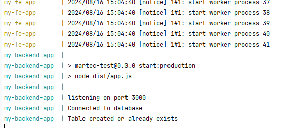

## Test 1

This project includes a frontend and a backend service. Docker Compose is used to manage and run these services in
isolated containers.
****

## Prerequisite:

Ensure you have the following installed on your machine:

- [Docker](https://docs.docker.com/get-docker/)
- [Docker Compose](https://docs.docker.com/compose/install/)
- Node.js v20 (if want to build source)

****

## Project Structure

- `martec-fe/` - Contains the frontend application built with Vite and Vue.js.
- `martec-be/` - Contains the backend application built with Node.js and Express.

****

## Running the Application

Follow these steps to build and run the application using Docker Compose:

**1. Clone the Repository**

   ```bash
   git clone <repository-url>
   cd <repository-directory>
   ```

**2. Check the .env file**

- There are 2 env file `frontend.env` and `backend.env` using for running `docker-compose.yml` file
- Change them accordingly

**3. Build and Start the Containers**

   ```bash
   docker-compose up --build
   ```

**4. Access the Application**

* Frontend: Open your web browser and navigate to http://localhost:5173 to access the frontend application.
* Backend: The backend service will be available at http://localhost:3000.
* App port can be change in `docker-compose.yml`

**5. Others**

* You can modify the env variable inside `docker-compose.yml` file to change the setup
* You can verify app is running in Docker compose logs
* You can go to `http://localhost:3000/heath` to see all available `ENV_VARIABLES`


******

## Technical note

### Oauth 2.0 flow

1. User request `/api/metadata` for render the UI, if cookie not present in request, assume user logged out and show 2
   login button
2. On user click Login button base on type, Open consent screen for Login
3. After successful login in consent screen, they will auto redirect to our `/api/:type/callback` endpoint, using the
   `code` they provide and get the `access_token` save into database
4. After done all the flow, DB should have token, and we start set the cookie back to front-end
5. From now on browser contains cookie and use that to request our back-end, and back-end using the token to call the
   actual request to Drive

> We don't want to store the access_token in client side, that why we save in back-end database and use the cookie to
> retain session with server


### Choose the database design

Since the integration might be expands and will have lot more thing to consider other than `accessToken`
or `refreshToken`.
So the table will have kind of unique design to comprehend that (picture bellow)

It should be in NoSQL database but for now im only using SQlite as main database for simplicity

Every time user request with `userID` bind in cookies, we can get which integration type are enable for that user,
So if 1 user (email) connect to 1 or 2 or how many platform, FE can still render the feature base on that,

Api is secure by default since it need signed cookies to actually get the logged-in user metadata

#### Example:

- User sangpd connect to 2 platform, He can show both platform resource's
- He wants to disconnect google, we only need `DELETE * FROM metadata WHERE user_id = ? AND type = 'GOOGLE'`, after that
  the FE will no longer render resource of Google
- If he wants connects again, just click `Login with` and begin oauth2 flow again
- ...

